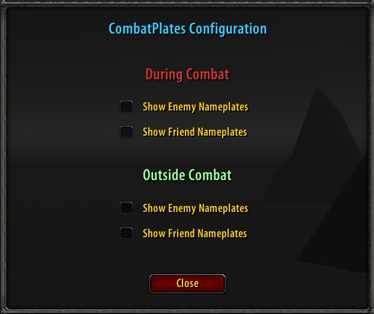
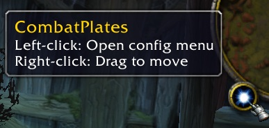

# CombatPlates

A lightweight World of Warcraft 1.12 (Vanilla) addon that gives you precise control over nameplate visibility during combat and non-combat states.

## Features

- **Automatic nameplate visibility**: Configure nameplates to automatically show or hide whether in or out of combat
- **Precise control**: Independent controls for enemy and friendly nameplates
- **Minimap button**: Easy access, movable button
- **Clean UI**: Simple configuration interface
- **Persistent settings**: Preferences save automatically across sessions

## Installation

### Manual installation

1. [Download the latest version.](https://github.com/phrxqt/CombatPlates/releases/latest)
2. Extract the `CombatPlates` folder to your `\Interface\AddOns\` directory
3. Restart WoW or type `/reload` in-game

### Automatic installation for Turtle WoW

Turtle WoW Launcher can easily install the addon and automatically check for updates on launch.

Open **Turtle WoW Launcher** > **Addons** tab > **+Add new addon** > paste this GitHub repository URL:

`https://github.com/phrxqt/CombatPlates`

## Usage

### Opening the Configuration
- **Slash commands**: `/cp` or `/combatplates`
- **Minimap button**: Left-click the icon on your minimap

### Configuration Options

**During Combat:s**
- Show Enemy Nameplates
- Show Friend Nameplates

**Outside Combat:**
- Show Enemy Nameplates
- Show Friend Nameplates

### Minimap Button

- **Left-click**: Open configuration menu
- **Right-click + drag**: Move button around minimap

## License

This project is licensed under the MIT License. See the [LICENSE](LICENSE) file for details.